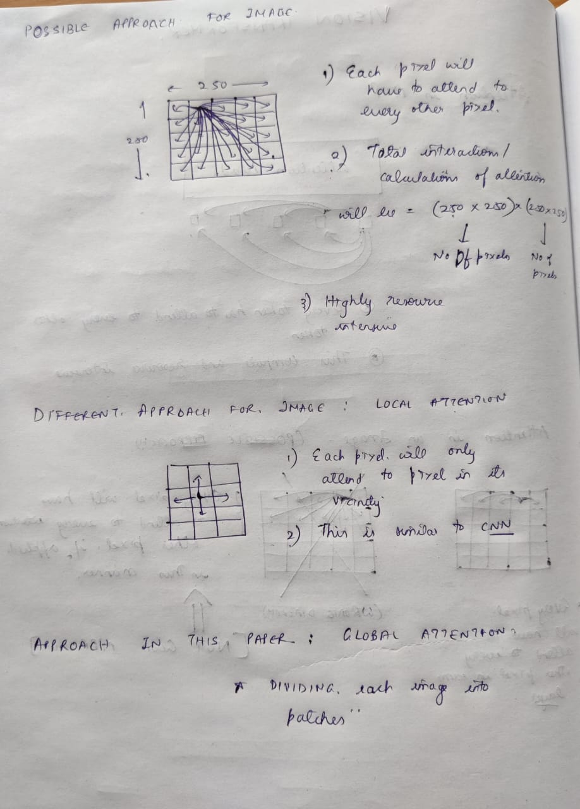
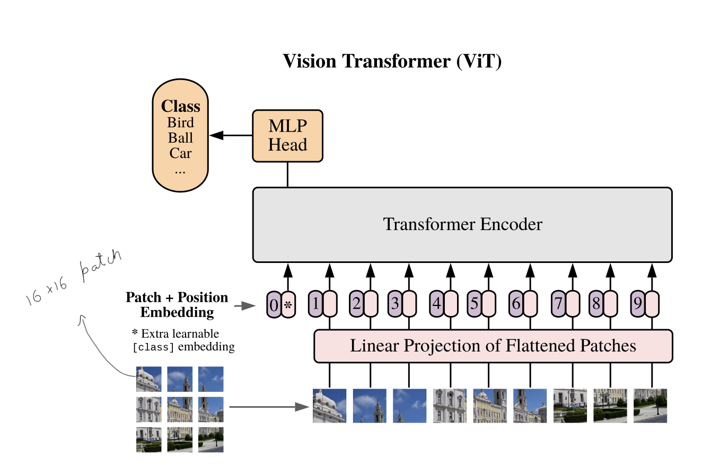
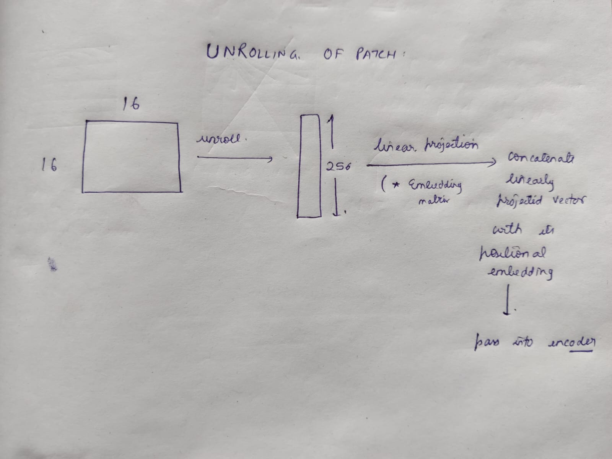

**Notes on arhictecture**

* Transformers had been introduced with a focus on NLP.

* Time was to apply transformer on images.

* Some possible approaches we might thing of for applying attention on images are shown in the following picture:

  

* In this paper, authors used global attention, lets look at what it is:

  

**Note** We will not be actually passing numbers 1, 2, or 3 for specifying the position. We will pass embeddings at index 1 for patch 1 and so on. The embedding matrix is learnable.

* The pathces themselves are 16x16, we will have to make them suitable for input to transformer hence we perform unrolling. The steps are shown below.

  

* The authors also add a learnable embedding [CLS] at the beginning of the patch sequence. This embedding serves helps in classification of the image.

* Thats it, these were some quick notes. I plan to make a blog post about this paper after my implementation.

